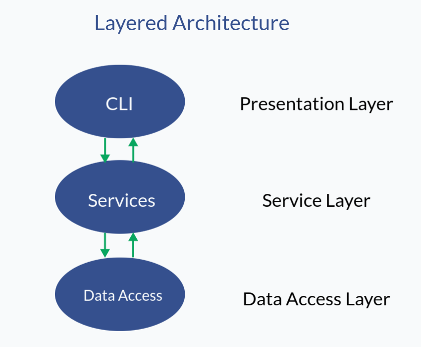

# Ioet Schedule Exercise
## Overview
This project allows you to effectively manage the number of coincidences between your worker's schedules. The main processes are subtracting data from a .txt file, calculating the number of coincidences, and returning the data to the <a href="https://en.wikipedia.org/wiki/Command-line_interface">CLI</a>. The technologies used to carry out this project are Javascript and <a href="https://nodejs.org/en/about/">Node.js</a> for development and <a href="https://jestjs.io/">Jest</a> for testing. Also, I applied the n-tier layered architecture and a <a href="https://www.freecodecamp.org/news/an-introduction-to-test-driven-development-c4de6dce5c/">TDD</a> methodology for reusability and readibility.
## Q/A

### How was this project carried out?

The first part was about understanding the problem. Knowing what we want to achieve is essential when leading a project. The problem was finding how many working coincidences share employees in their schedule given a data set. In addition, I had to consider some essential aspects like the use of tests, a successful architecture, and a methodology. With all of this in mind, I made a to-do list, set the times, and started by doing one task at a time. The following is a list that contemplates the activities carried out throughout the project:

1. Design
    - Understand problem
    - Define architecture
    - Define methodology
    - Define programming language
    - Define design patterns
    - Define test-running system
    - Draw an architecture diagram
    - Draw an object diagram

2. Development
    - Create GitHub repository
    - Create the architecture folder structure
    - Write necessary pseudocode
    - Install test-running system
    - Create a CLI function
    - Develop scheduleModel.js to retrieve data
    - Write unit tests for calculateCoincidences()
    - Develop scheduleService.js
    - Create entities
    - Create utils
    - Refactor code
    - Write integration test

3. Documentation
    - Write a paragraph about the project
    - Write about the architecture
    - Write about the code
    - Write an installation manual


### How was the architecture constructed in this project?

There are some elements that I took into consideration when choosing an appropriate architecture. A relevant requirement is that the front-end was not required to be developed. Instead, the project needed a CLI so the user could interact with the system. For this reason, architectures that contemplated client use were discarded, such as MVC, client-server, etc. Instead, I opted for a layered n-tier architecture for its flexibility and simplicity since I could implement a solution by applying good development practices without oversizing the problem.



> Image about the used layered architecture.

1. Presentation Layer: This layer is for user interaction. I have put the Command Line Interface (CLI) logic. If we wanted to improve the UI, we could replace the CLI with a client application. 
2. Service Layer: This layer is for business logic. I have put the service that calculates working coincidences here. Note that we have linked the presentation layer and the services layer directly. There is no need to implement an additional layer since we do not require a server, but we could add an intermediate routing layer to extend the application.
3. Data Access Layer: This layer is for handling data. I used this layer to access the data and put it in the correct format. For this, I have relied on the creation of a model. If we wanted to extend our project, we could create more actions within this layer, such as updating the txt file, inserting data, etc.
## Development

Parrafo

Codigo mas importante y su respectiva prueba
Mencion de utils y entities

## Getting started

### Built with
- node: 18.12.0
- npm: 8.19.2
- jest: 29.2.2
### Prerequisites

Please download and install <a href="https://nodejs.org/en/download/">Node.js</a>
### Installation

First, clone the repository and open the contained folder in your text editor of choice:

```shell
git clone https://github.com/parduccinward/ioet-schedules-exercise
cd ioet-schedules-exercise
code .
```

Then, open a terminal and run the following installation command using npm:

```shell
npm i -g
```

## Using the CLI

To get the working coincidences, you need to use a reserved command. First, go to the project directory. Then, open a terminal and run the following command:

```shell
coincidences
```

Using the default data, the expected output should be the following:

```console
RENE-ASTRID:2
RENE-ANDRES:2
RENE-DIEGO:4
RENE-JOSE:3
ASTRID-ANDRES:3
ASTRID-DIEGO:3
ASTRID-JOSE:3
ANDRES-DIEGO:3
ANDRES-JOSE:3
DIEGO-JOSE:4
```
### Recommendation

- This project does not support checking the correct syntax of the .txt file. Please be careful when putting data on the .txt file without following the correct syntax. (Can lead to bugs)

## ToDo List

- [x] Retrieve data from the .txt file
- [x] Get coincidences about working schedules
- [x] Use module patterns
- [x] Use unit and integration tests
- [ ] Check data.txt syntax
- [ ] Inserting data via console
- [ ] Get employee by name

